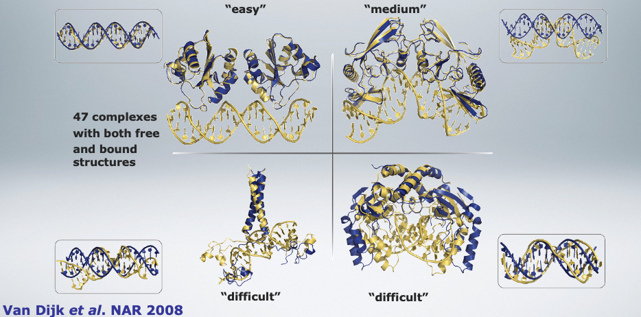

## Prot-DNA Docking Benchmark

### Introduction

Biomolecular docking aims at predicting the structure of a complex given the three dimensional structures of its components. Although much improvement has been made in the field of protein-protein docking, in the case of protein-DNA complexes, however, progress lags behind. The scarcity of information for proper identification of interaction surfaces on DNA and its inherent flexibility have hampered the development of effective docking methods. To facilitate the development of effective protein-DNA docking methods a set of well-defined test cases that form a common ground for development, validation and comparison of docking methods is necessary.

We present here a protein-DNA docking benchmark containing 47 unbound-unbound test cases, of which 13 are classified as easy cases, 22 as intermediate cases and 12 as difficult cases. The latter show considerable structural rearrangement upon complex formation. DNA-specific modifications such as flipped out bases and base modifications are included. The benchmark covers all major types of DNA binding proteins according to the classifications of Luscombe et al., Genome Biol 2010. The variety in test cases make this non-redundant benchmark a useful tool for comparison and further development of protein-DNA docking methods.

We developed the protein-DNA benchmark to be of general use to the docking community. We welcome all suggestions aimed at improving or expanding the benchmark.

* * *

### Current version

The current version of the protein-DNA benchmark is 1.2

* * *

### Version history

* 01-01-2008 | The original protein-DNA benchmark version 1.0 release.

* 14-08-2008 | Benchmark version 1.1: Minor updates. The bound to unbound residue mapping file (profit.dat) has been redesigned to make it more flexible in use. The PDB structure file that represents the complex reconstructed from the unbound processed components after superimposition contained more than one instance of the same complex coordinate set. This has been fixed.

* 22-09-2009 | Benchmark version 1.2: Small fixes in residue mapping for two entries. For two entries (1EYU,1RVA) the unbound protein was composed off two distinct subunits. These have now been separated into individual pdb files and all other files have been adjusted accordingly.

* * *

### Citation

When using the protein-DNA docking benchmark please cite using the following reference:

* M. van Dijk and A.M.J.J. Bonvin
[A protein-DNA docking benchmark.](https://doi.org/doi:10.1093/nar/gkn386)
_Nucl. Acids Res._ (2008), *36*, e88, doi: 10.1093/nar/gkn386.

* * *

### Data organization

The benchmark in organized in directory structure, containing one directory per complex corresponding to the PDB ID of the reference structure.

Each directory contains the following files:

* _X.pdb_ and _Y.pdb_ :	The unmodified RCSB PDB files for the structure of the complex and the structure of the unbound protein
								
* _X_bound-prot(x).pdb_ : The processed PDB file of the bound protein (extracted from the complex) 

* _X_bound-DNA.pdb_ : The processed PDB file of the bound DNA (extracted from the complex)
								
* _Y_unbound-prot(x).pdb_ : Structure files of the unbound protein, processed. In case of an NMR ensemble the file is separated into its individual models.
								
* _DNA_unbound.pdb_ : 3DNA generated unbound canonical BDNA representation.

* _X_complex.pdb_ :	PDB file of the bound complex reconstructed from the individual processed bound structures.
								
* _X_ubcomplex.pdb_ : Structure file of the complex reconstructed from the unbound processed components after superimposition using all CA and P atoms.
								
* _interface_fit.dat_ : Data file containing the residue zones for all unbound components that have CA atoms at the interface

* _interface_fit.pdb_ : PDB file of the unbound protein after superimposition on the bound structure using CA atoms.

* _contacts.dat_ : Text file listing all intermolecular contacts in the bound complex.

* _contacts_ub.dat_ : Text file listing all intermolecular contacts in the bound complex (unbound re-numbered).
								
* _alignment.dat_ : Text file of a Needleman-Wunsch sequence alignment between bound and unbound protein sequences.
							
* _profit.dat_ : Text file containing ProFit structure fitting data for automatic structure fitting using ProFit

**Note** that the processed PDB files have been modified to avoid any overlap in residue numbering (e.g. shifting the numnber of the second DNA strand). Also the DNA nomenclature follows a three letter code (ADE, CYT, GUA, THY) compatible with [HADDOCK2.2](https://www.bonvinlab.org/software/haddock2.2).  For use in [HADDOCK2.4](https://www.bonvinlab.org/software/haddock2.2), the base names must be reverted to a single letter code (A,C,G,T).

